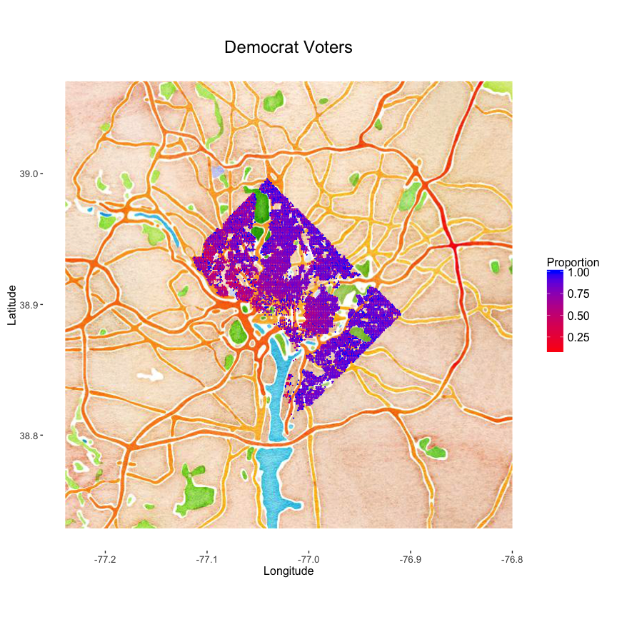
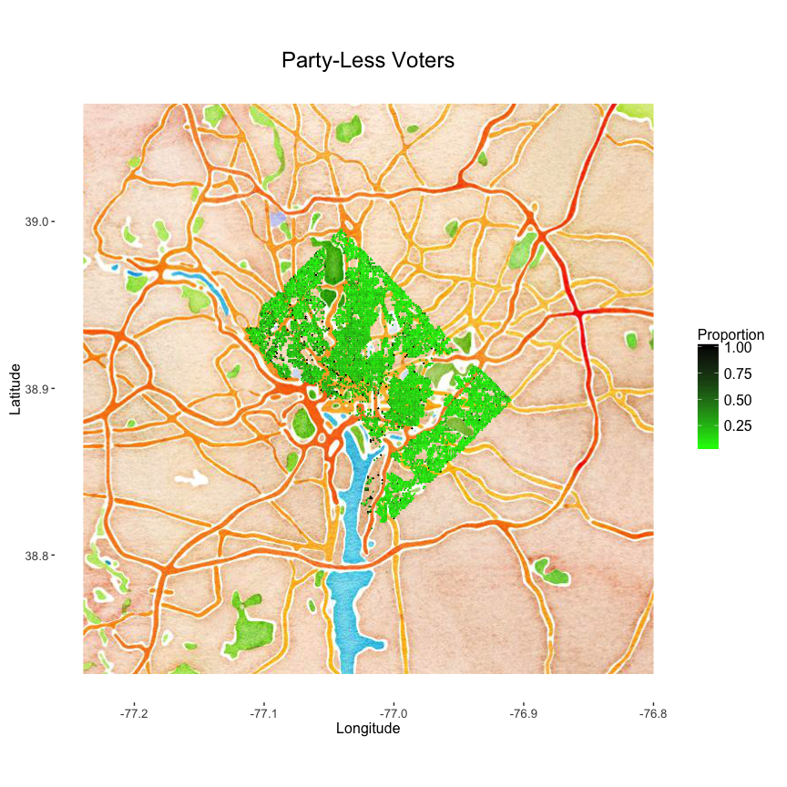
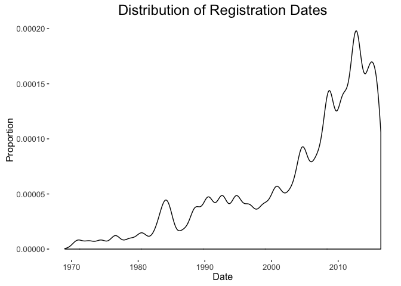

Registered Voters in Washington DC
----------------------------------

The District of Columbia Board of Elections publicly released voter
registration data as for 435,306 registered voters in Washington, DC in
May 2016, which can be accessed at the following link
<https://www.dcboee.org/pdf_files/ListOfRegisteredVoters051616.pdf>.
Whether or not this data should be posted publically is a good question,
but nothing should ever be posted as a 9,000 page .pdf file! Here's a
quick look into what kind of aggregate statistics can we learn from this
data after transforming it into a workable form.

1.  There are 336,000 registered Democrats, 28,000 registered
    Republicans, and 72,000 individuals not registered with
    either party. That means 77% of registered voters are Democrats and
    only 6% are Republicans!

2.  The highest density of registered Republicans is located on Boling
    Airforce Base, which contains the only two square kilometers with
    more than 50% registered Republicans.

3.  We can map the data to see where the greatest density of Democrats,
    Republicans, and Party-less voters are.
    
4.  40% of the registered voters have registered since 2010, and over
    10,000 voters registered before 1980. Since 2000, voter registration
    has peaked around election years.
    
5.  And ward 7 has the highest proportion of registered Democrats.

<table>
<thead>
<tr class="header">
<th align="right">Ward</th>
<th align="left">Party</th>
<th align="right">Count</th>
<th align="right">Proportion</th>
</tr>
</thead>
<tbody>
<tr class="odd">
<td align="right">1</td>
<td align="left">DEM</td>
<td align="right">41161</td>
<td align="right">0.76</td>
</tr>
<tr class="even">
<td align="right">1</td>
<td align="left">N-P</td>
<td align="right">10415</td>
<td align="right">0.19</td>
</tr>
<tr class="odd">
<td align="right">1</td>
<td align="left">REP</td>
<td align="right">2698</td>
<td align="right">0.05</td>
</tr>
<tr class="even">
<td align="right">2</td>
<td align="left">DEM</td>
<td align="right">27290</td>
<td align="right">0.65</td>
</tr>
<tr class="odd">
<td align="right">2</td>
<td align="left">N-P</td>
<td align="right">9385</td>
<td align="right">0.22</td>
</tr>
<tr class="even">
<td align="right">2</td>
<td align="left">REP</td>
<td align="right">5326</td>
<td align="right">0.13</td>
</tr>
<tr class="odd">
<td align="right">3</td>
<td align="left">DEM</td>
<td align="right">34889</td>
<td align="right">0.68</td>
</tr>
<tr class="even">
<td align="right">3</td>
<td align="left">N-P</td>
<td align="right">9953</td>
<td align="right">0.19</td>
</tr>
<tr class="odd">
<td align="right">3</td>
<td align="left">REP</td>
<td align="right">6381</td>
<td align="right">0.12</td>
</tr>
<tr class="even">
<td align="right">4</td>
<td align="left">DEM</td>
<td align="right">46559</td>
<td align="right">0.81</td>
</tr>
<tr class="odd">
<td align="right">4</td>
<td align="left">N-P</td>
<td align="right">8564</td>
<td align="right">0.15</td>
</tr>
<tr class="even">
<td align="right">4</td>
<td align="left">REP</td>
<td align="right">2219</td>
<td align="right">0.04</td>
</tr>
<tr class="odd">
<td align="right">5</td>
<td align="left">DEM</td>
<td align="right">47942</td>
<td align="right">0.82</td>
</tr>
<tr class="even">
<td align="right">5</td>
<td align="left">N-P</td>
<td align="right">8258</td>
<td align="right">0.14</td>
</tr>
<tr class="odd">
<td align="right">5</td>
<td align="left">REP</td>
<td align="right">2122</td>
<td align="right">0.04</td>
</tr>
<tr class="even">
<td align="right">6</td>
<td align="left">DEM</td>
<td align="right">49818</td>
<td align="right">0.73</td>
</tr>
<tr class="odd">
<td align="right">6</td>
<td align="left">N-P</td>
<td align="right">12083</td>
<td align="right">0.18</td>
</tr>
<tr class="even">
<td align="right">6</td>
<td align="left">REP</td>
<td align="right">6407</td>
<td align="right">0.09</td>
</tr>
<tr class="odd">
<td align="right">7</td>
<td align="left">DEM</td>
<td align="right">44893</td>
<td align="right">0.86</td>
</tr>
<tr class="even">
<td align="right">7</td>
<td align="left">N-P</td>
<td align="right">6344</td>
<td align="right">0.12</td>
</tr>
<tr class="odd">
<td align="right">7</td>
<td align="left">REP</td>
<td align="right">1207</td>
<td align="right">0.02</td>
</tr>
<tr class="even">
<td align="right">8</td>
<td align="left">DEM</td>
<td align="right">43064</td>
<td align="right">0.84</td>
</tr>
<tr class="odd">
<td align="right">8</td>
<td align="left">N-P</td>
<td align="right">7082</td>
<td align="right">0.14</td>
</tr>
<tr class="even">
<td align="right">8</td>
<td align="left">REP</td>
<td align="right">1246</td>
<td align="right">0.02</td>
</tr>
</tbody>
</table>
